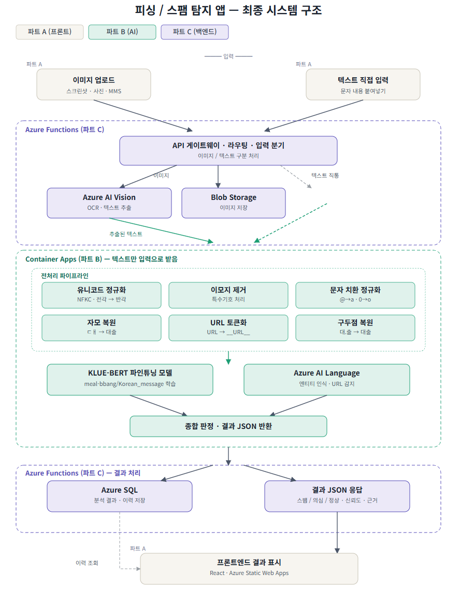
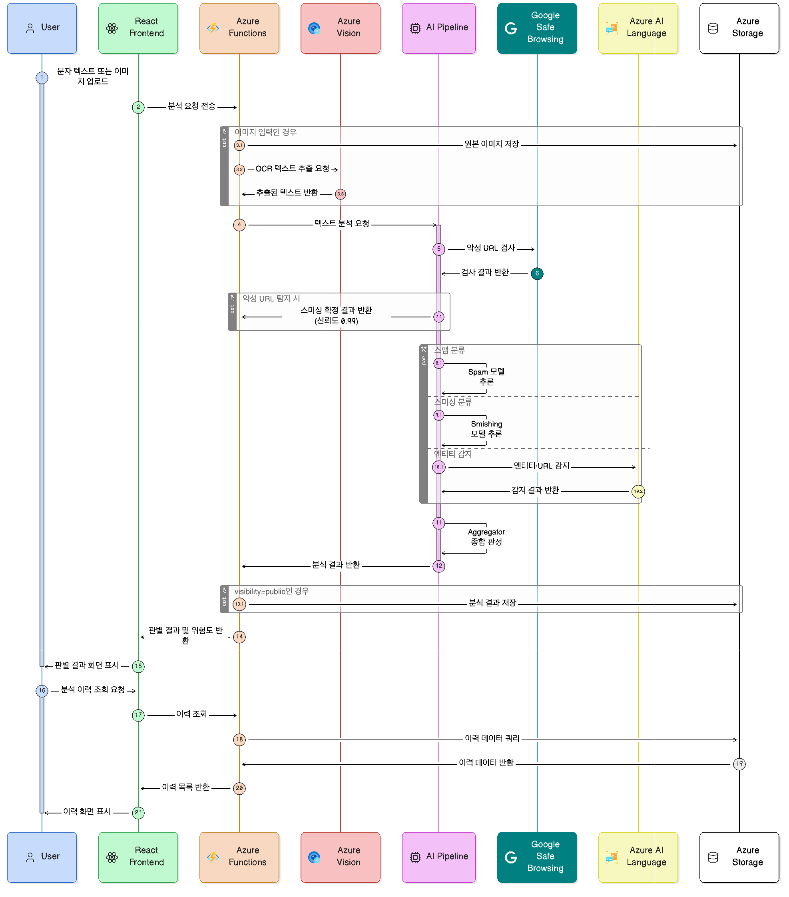

# Azure 클라우드 기반 스미싱·스팸 문자 분석 및 판별 서비스 개발


## 프로젝트 멤버 및 역할

| 구성원 | 담당 파트    | 주요 역할                                                                                             |
| --- | -------- | ------------------------------------------------------------------------------------------------- |
| 이재효 | 프론트엔드    | React 기반 UI 개발, Azure Static Web Apps 배포, 백엔드 API 연동                                              |
| 문진서 | AI 파이프라인 | 스팸·스미싱 탐지 AI 파이프라인 개발, Google Safe Browsing 연동, Azure AI Language 연동, Azure Container Apps 배포     |
| 오현식 | 백엔드/인프라  | Azure 전체 리소스 설계 및 구성, Azure Functions API 개발, Azure Vision OCR 연동, Blob Storage·Azure SQL 설계 및 구현 |

## 프로젝트 소개

본 프로젝트는 Azure 클라우드 서비스를 활용하여 스미싱 및 스팸 문자를 분석 및 판별하는 웹 서비스를 개발한다. 사용자가 의심스러운 문자 메시지 텍스트 또는 이미지를 입력하면, Azure Vision의 OCR 기술로 이미지에서 텍스트를 추출하고 Azure Blob Storage에 원본 이미지를 저장한다.

추출된 텍스트는 Google Safe Browsing, 스팸 분류 모델(`blockenters/sms-spam-classifier`), 스미싱 분류 모델(`Hyeonseo/ko-smishing-detector`), Azure AI Language Service를 결합한 AI 파이프라인을 통해 분석된다. 시스템은 우선 Google Safe Browsing을 이용하여 URL의 악성 여부를 검사하고, 악성 URL로 확인될 경우 즉시 스미싱으로 판정한다. 정상 URL인 경우에는 스팸 모델과 스미싱 모델을 병렬로 실행하여 각각의 위험도를 계산하며, Azure AI Language Service를 통해 탐지된 URL, 기관명, 전화번호 등의 엔티티 정보를 추가적으로 반영한다.

최종 분석 결과는 Azure SQL Database에 저장되며, 사용자는 React 기반 프론트엔드를 통해 분석 결과 및 이력을 조회할 수 있다. 시스템은 Azure Functions(백엔드 API), Azure Container Apps(AI 모델 서빙), Azure Static Web Apps(프론트엔드)로 구성된 클라우드 네이티브 아키텍처로 구현된다.

## 프로젝트 필요성

의심스러운 문자나 이메일을 받았을 때, 일반 사용자가 스팸 여부를 직접 판단하기는 어렵다. 본 서비스는 Google Safe Browsing을 활용한 악성 URL 검증과 한국어 데이터로 학습된 스팸·스미싱 전용 AI 모델을 결합하여 보다 신뢰성 있는 판별 결과를 제공한다. 또한 Azure AI Language Service를 활용하여 URL, 기관명, 전화번호 등의 위험 엔티티를 추출하고 이를 최종 판단 근거로 함께 제공한다.

이를 통해 사용자는 단순히 스팸 여부만 확인하는 것이 아니라 어떤 요소가 위험 신호로 작용했는지 확인할 수 있으며, 문자 내용 복사가 어려운 경우에도 이미지 업로드만으로 분석을 수행할 수 있다.

**활용 시나리오는 다음과 같다.**

* **Use Case 1 — 의심 문자 텍스트 분석**: 사용자가 수신한 의심 문자 내용을 복사하여 서비스에 붙여넣으면, AI 파이프라인이 스팸 및 스미싱 여부와 위험도를 판별하고 판단 근거를 함께 제공한다.
* **Use Case 2 — 스크린샷 이미지 분석**: 문자 메시지 앱의 스크린샷을 업로드하면 OCR로 텍스트를 추출한 뒤 동일하게 분석한다. 텍스트 복사가 어려운 상황에서 유용하다.
* **Use Case 3 — 분석 이력 조회**: 이전에 분석한 메시지 목록과 결과를 조회하여 유사 스팸 패턴을 파악하거나 재확인할 수 있다.


## 관련 기술 / 논문 / 특허 조사

### 1. KISA 스미싱 확인 서비스

한국인터넷진흥원(KISA)이 운영하는 대국민 스미싱 확인 서비스로, 2024년 3월에 개시되었다. 이용자가 의심 문자를 '보호나라' 사이트에 직접 입력하면 정상·주의·악성 3단계로 판정 결과를 제공한다. 이동통신사·스팸솔루션 업체 등 민간과 협력하여 URL 및 발신 번호를 분석하며, 분석 완료까지 최대 10분이 소요된다.

다만 판별 결과만 제공할 뿐 왜 스팸으로 판단했는지의 근거는 제공하지 않으며, 이미지 형태의 스팸 문자는 대응하지 못한다는 한계가 있다.

출처: [KISA 보호나라 스미싱 확인 서비스](https://www.boho.or.kr/kr/subPage.do?menuNo=205116)

---

### 2. 카카오뱅크 AI 스미싱 문자 확인 서비스

카카오뱅크 금융기술연구소가 2024년 12월 출시한 서비스로, BERT 기반 분류 모델과 금융 특화 파인튜닝 LLM을 병렬 운용하여 스미싱을 탐지한다. 이용자가 의심 문자를 앱에 복사·붙여넣기하면 스미싱 위험이 높은 문자 / 안전한 문자 / 단순 스팸 / 판단 불가 4가지로 분류하고, "출처가 불분명한 URL을 포함하고 있다", "배송 사기 스팸의 한 사례" 등 구체적인 판단 근거를 자연어로 함께 제공한다는 점이 특징이다. 출시 1년 만에 30만 명이 이용하고 약 4만 1천 건의 스미싱이 탐지되었다. 이후 KISA 스미싱 확인 서비스와 연동하여 탐지 정확도를 추가로 강화하였다.

다만 카카오뱅크 앱 전용 폐쇄형 서비스로 외부 API를 제공하지 않으며, 텍스트 직접 입력 방식만 지원하여 이미지 기반 스팸은 처리할 수 없다.

출처: [카카오뱅크 AI Tech Blog — AI 스미싱 문자 확인 서비스](https://ai.kakaobank.com/1540bbc2-6fb5-80cf-b5ac-edf90e98c9a5)

---

### 3. 통신사 및 단말기 레벨 스팸 필터링

SKT는 2007년부터 자체 스팸 필터링 시스템을 운영해 왔으며, 현재는 딥러닝 기반의 PASS 스팸필터링과 통화패턴 분석 AI 모델(스캠뱅가드)을 통해 2025년 한 해 약 11억 건의 통신 사기를 차단하였다. 삼성전자는 2025년 3월부터 방통위·KISA와 협업하여 갤럭시 S25 시리즈에 온디바이스 AI 기반 스팸 자동 차단 기능을 탑재하였다. 이들은 각각 통신망과 단말기 레벨에서 동작하기 때문에 외부에 API를 제공하지 않으며, 스팸 여부 판별 결과만 제공할 뿐 판단 근거를 이용자에게 설명하지 않는다.

출처: [SKT 뉴스룸 — PASS 스팸필터링](https://news.sktelecom.com/205875)

---

### 선행기술과의 차별점

기존 서비스들은 공통적으로 두 가지 한계를 가진다. 첫째, 이미지 형태로 수신된 스팸 문자를 처리하지 못한다. 둘째, 카카오뱅크 서비스를 제외하면 스팸 판별 결과만 제공할 뿐 판단 근거를 설명하지 않으며, 카카오뱅크 서비스조차 외부에 API를 개방하지 않는 폐쇄형 구조이다.

본 프로젝트는 Azure Vision OCR을 통해 이미지 입력까지 처리하고, Google Safe Browsing 기반 악성 URL 검증, 스팸·스미싱 전용 AI 모델, Azure AI Language의 엔티티 분석을 결합하여 스팸 및 스미싱을 판별한다. 또한 URL, 기관명, 전화번호 등 탐지된 위험 요소를 함께 제공하여 단순 판별 결과뿐 아니라 구체적인 판단 근거를 제공한다는 점에서 기존 선행 서비스들과 차별화된다.


---

## 개발 결과물 소개

### 시스템 아키텍처



### 요청 흐름 (시퀀스 다이어그램)



## 사용 방법

## 개발 환경 설정 가이드

파트 A(프론트엔드) · B(AI) · C(백엔드) 각각의 로컬 실행 방법.  
Azure 리소스(Functions, Container Apps, SQL 등)는 별도로 프로비저닝 필요 → [`Azure_services.md`](Azure_services.md) 참조.

---

### 공통 필수 도구

| 도구 | 버전 | 설명 |
|---|---|---|
| Node.js | 18 이상 | 프론트엔드 실행 |
| Python | 3.11 | 백엔드·AI 실행 |
| uv | 최신 | Python 가상환경 + 패키지 관리 |
| Azure Functions Core Tools | v4 | 백엔드 로컬 실행 (`func start`) |
| ODBC Driver 18 for SQL Server | 18 | 백엔드 Azure SQL 연결 |

### Windows

```powershell
winget install OpenJS.NodeJS
winget install astral-sh.uv
winget install Microsoft.AzureFunctionsCoreTools
winget install Microsoft.msodbcsql.18
```

### macOS

```bash
brew install node
curl -LsSf https://astral.sh/uv/install.sh | sh
brew tap azure/functions && brew install azure-functions-core-tools@4
brew tap microsoft/mssql-release https://github.com/Microsoft/homebrew-mssql-release
brew install msodbcsql18
```

> 설치 후 터미널을 재시작해야 `func` 명령이 인식됨.

---

### 파트 A — 프론트엔드

```bash
cd frontend
npm install
npm run dev
```

브라우저에서 `http://localhost:5173` 접속.  
백엔드 연동 전에는 API 호출이 실패하므로, 파트 C 로컬 서버를 함께 띄워야 정상 동작.

---

### 파트 B — AI 서비스

```bash
cd ai
uv venv --python 3.11
source .venv/bin/activate   # Windows: .venv\Scripts\activate
uv pip install -r requirements.txt
```

환경변수 설정 — `.env` 파일을 `ai/` 디렉토리에 생성:

```
AZURE_LANGUAGE_ENDPOINT=<Azure AI Language 엔드포인트>
AZURE_LANGUAGE_KEY=<Azure AI Language API 키>
GOOGLE_SAFE_BROWSING_API_KEY=<Google Safe Browsing API 키>
```

> 두 키 모두 없어도 서버는 실행됨. 해당 기능만 비활성화(`"enabled": false`)되고 모델 추론은 정상 동작.

로컬 실행:

```bash
uvicorn app.main:app --reload --port 8000
```

`http://localhost:8000` 접속 시 `{"message": "AI service is running"}` 응답 확인.  
최초 실행 시 HuggingFace에서 모델을 자동 다운로드하므로 시간이 걸릴 수 있음.

---

### 파트 C — 백엔드

```bash
cd backend
uv venv --python 3.11
source .venv/bin/activate   # Windows: .venv\Scripts\activate
uv pip install -r requirements.txt
```

환경변수 설정 — `local.settings.json.example`을 복사해 `local.settings.json` 생성 후 각 값을 채움:

```bash
cp local.settings.json.example local.settings.json
```

| 키 | 설명 |
|---|---|
| `AZURE_VISION_ENDPOINT` | Azure Vision 리소스 → 키 및 엔드포인트 |
| `AZURE_VISION_KEY` | 동일 |
| `BLOB_CONNECTION_STRING` | 스토리지 계정 → 액세스 키 → 연결 문자열 |
| `BLOB_CONTAINER_NAME` | 컨테이너 이름 (기본값: `images`) |
| `SQL_CONNECTION_STRING` | SQL Database → 연결 문자열 → ODBC |
| `CONTAINER_APP_URL` | 파트 B Container App 배포 후 입력 |

> `local.settings.json`은 `.gitignore`에 포함되어 커밋되지 않음.

로컬 실행:

```bash
func start
```

정상 실행 시:

```
Functions:
    analyze: [POST] http://localhost:7071/api/analyze
    history: [GET]  http://localhost:7071/api/history
```

---

### 동작 확인

파트 B(`localhost:8000`)와 파트 C(`localhost:7071`)를 모두 띄운 상태에서 테스트.  
API 명세는 [`api-contract.md`](api-contract.md) 참조.

**텍스트 분석:**

```bash
curl -X POST http://localhost:7071/api/analyze \
  -H "Content-Type: application/json" \
  -d '{"text": "고객님 계좌가 정지되었습니다. 아래 링크를 눌러 인증하세요."}'
```

**이미지 분석:**

```bash
curl -X POST http://localhost:7071/api/analyze \
  -F "file=@/path/to/image.jpg"
```

**이력 조회:**

```bash
curl "http://localhost:7071/api/history?limit=10&offset=0"
```

### 서비스 접속

배포된 프론트엔드 서비스는 아래 주소에서 접속할 수 있다.

- 서비스 URL: https://gray-ocean-093b63900.7.azurestaticapps.net/

의심 문자 텍스트를 직접 입력하거나 이미지 파일을 업로드하여 스팸·스미싱 분석 결과를 확인할 수 있다.


## 활용방안

본 서비스는 일반 사용자가 수신한 의심 문자 메시지의 스팸 및 스미싱 여부를 보다 쉽게 확인할 수 있도록 지원하는 서비스로 활용될 수 있다.

### 1. 일반 사용자 대상 스미싱 예방 서비스

* 사용자가 수신한 문자 내용을 직접 입력하거나 문자 스크린샷을 업로드하여 스팸 및 스미싱 여부를 확인할 수 있다.
* Google Safe Browsing, AI 모델, 엔티티 분석 결과를 기반으로 스팸 여부뿐 아니라 판단 근거까지 함께 제공하여 사용자의 의사결정을 지원한다.
* 최근 증가하고 있는 기관 사칭, 배송 사칭, 금융 사기형 스미싱 문자에 대한 예방 도구로 활용 가능하다.

### 2. 디지털 취약계층 지원

* 고령층 등 스미싱 여부를 직접 판단하기 어려운 사용자가 의심 문자를 손쉽게 분석할 수 있다.
* 문자 내용을 복사하기 어려운 경우에도 스크린샷 이미지만 업로드하면 OCR을 통해 자동으로 분석할 수 있다.
* 스팸 및 스미싱으로 인한 금전적·개인정보 피해를 예방하는 보조 도구로 활용될 수 있다.

---

## AI 활용

본 프로젝트 개발 과정에서는 생성형 AI를 개발 보조 도구로 활용하였다. 팀원들은 각각 ChatGPT(OpenAI), Claude(Anthropic), Gemini(Google)를 활용하여 코드 작성, 기술 조사, 오류 분석 및 디버깅, 문서 작성 등의 작업을 수행하였다.

주요 활용 내용은 다음과 같다.

* Azure 서비스 사용법 및 설정 방법 조사
* FastAPI, React, Azure Functions 구현 지원
* Google Safe Browsing API 및 Azure AI 서비스 연동
* Docker 및 Azure 클라우드 배포 과정 지원
* 오류 분석 및 디버깅
* API 설계 및 데이터 처리 로직 검토
* README 및 프로젝트 문서 작성 지원

다만 생성형 AI가 제안한 코드와 설계를 그대로 적용하지 않고, 프로젝트 요구사항에 맞게 수정 및 검증 과정을 거쳐 사용하였다. 시스템 구조 설계, Azure 리소스 구성, 서비스 통합, 테스트 및 배포 과정은 팀원들이 직접 수행하였다.

프로젝트 전체 기준으로 약 50~60% 정도의 코드 작성 및 개발 과정에서 생성형 AI의 도움을 받았으며, 나머지는 프로젝트 환경에 맞게 수정·통합 및 검증하는 과정에서 직접 구현하였다.

