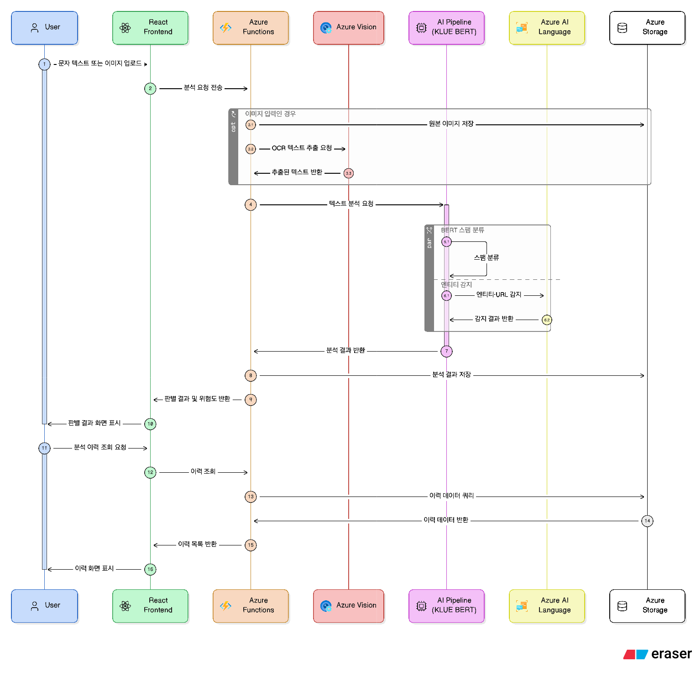

# Azure 클라우드 기반 스미싱·스팸 문자 분석 및 판별 서비스 개발

## 프로젝트 멤버 및 역할

| 구성원 | 담당 파트 | 주요 역할 |
|---|---|---|
| 이재효 | 프론트엔드 | React 기반 UI 개발, Azure Static Web Apps 배포, 백엔드 API 연동 |
| 문진서 | AI 파이프라인 | KLUE-BERT 파인튜닝 모델 개발, Azure AI Language 연동, Azure Container Apps 배포 |
| 오현식 | 백엔드/인프라 | Azure 전체 리소스 설계 및 구성, Azure Functions API 개발, Azure Vision OCR 연동, Blob Storage·Azure SQL 설계 및 구현 |

## 프로젝트 소개

본 프로젝트는 Azure 클라우드 서비스를 활용하여 스미싱 및 스팸 문자를 분석 및 판별하는 웹 서비스를 개발한다. 사용자가 의심스러운 문자 메시지 텍스트 또는 이미지를 입력하면, Azure Vision의 OCR 기술로 이미지에서 텍스트를 추출하고 Azure Blob Storage에 원본 이미지를 저장한다. 추출된 텍스트는 KLUE-BERT 파인튜닝 모델과 Azure AI Language(엔티티·URL 감지)를 결합한 AI 파이프라인을 통해 스팸 여부와 위험도를 판별한다. 분석 결과는 Azure SQL Database에 저장되며, 사용자는 React 기반 프론트엔드를 통해 분석 결과 및 이력을 조회할 수 있다. 시스템은 Azure Functions(백엔드 API), Azure Container Apps(AI 모델 서빙), Azure Static Web Apps(프론트엔드)로 구성된 클라우드 네이티브 아키텍처로 구현된다.

## 프로젝트 필요성

의심스러운 문자나 이메일을 받았을 때, 일반 사용자가 스팸 여부를 직접 판단하기는 어렵다. 본 서비스는 한국어 스미싱 데이터로 파인튜닝된 KLUE-BERT 모델과 Azure AI Language의 엔티티·URL 감지를 결합하여, 스팸 여부 판별과 함께 구체적인 판단 근거를 제공한다. 이를 통해 사용자는 단순한 스팸 분류 결과뿐 아니라 왜 해당 문자가 스팸으로 판단되었는지를 확인할 수 있다.

**활용 시나리오는 다음과 같다.**

- **Use Case 1 — 의심 문자 텍스트 분석**: 사용자가 수신한 의심 문자 내용을 복사하여 서비스에 붙여넣으면, AI 모델이 스팸 여부와 위험도를 판별하고 근거를 함께 제공한다.
- **Use Case 2 — 스크린샷 이미지 분석**: 문자 메시지 앱의 스크린샷을 업로드하면 OCR로 텍스트를 추출한 뒤 동일하게 분석한다. 텍스트 복사가 어려운 상황에서 유용하다.
- **Use Case 3 — 분석 이력 조회**: 이전에 분석한 메시지 목록과 결과를 조회하여 유사 스팸 패턴을 파악하거나 재확인할 수 있다.

## 관련 기술 / 논문 / 특허 조사

### 1. KISA 스미싱 확인 서비스

한국인터넷진흥원(KISA)이 운영하는 대국민 스미싱 확인 서비스로, 2024년 3월에 개시되었다. 이용자가 의심 문자를 '보호나라' 사이트에 직접 입력하면 정상·주의·악성 3단계로 판정 결과를 제공한다. 이동통신사·스팸솔루션 업체 등 민간과 협력하여 URL 및 발신 번호를 분석하며, 분석 완료까지 최대 10분이 소요된다.

다만 판별 결과만 제공할 뿐 왜 스팸으로 판단했는지의 근거는 제공하지 않으며, 이미지 형태의 스팸 문자는 대응하지 못한다는 한계가 있다.

출처: [KISA 보호나라 스미싱 확인 서비스](https://www.boho.or.kr/kr/subPage.do?menuNo=205116)

---

### 2. 카카오뱅크 AI 스미싱 문자 확인 서비스

카카오뱅크 금융기술연구소가 2024년 12월 출시한 서비스로, BERT 기반 분류 모델과 금융 특화 파인튜닝 LLM을 병렬 운용하여 스미싱을 탐지한다. 이용자가 의심 문자를 앱에 복사·붙여넣기하면 스미싱 위험이 높은 문자 / 안전한 문자 / 단순 스팸 / 판단 불가 4가지로 분류하고, "출처가 불분명한 URL을 포함하고 있다", "배송 사기 스팸의 한 사례" 등 구체적인 판단 근거를 자연어로 함께 제공한다는 점이 특징이다. 출시 1년 만에 30만 명이 이용하고 약 4만 1천 건의 스미싱이 탐지되었다. 이후 KISA 스미싱 확인 서비스와 연동하여 탐지 정확도를 추가로 강화하였다.

다만 카카오뱅크 앱 전용 폐쇄형 서비스로 외부 API를 제공하지 않으며, 텍스트 직접 입력 방식만 지원하여 이미지 기반 스팸은 처리할 수 없다.

출처: [카카오뱅크 AI Tech Blog — AI 스미싱 문자 확인 서비스](https://ai.kakaobank.com/1540bbc2-6fb5-80cf-b5ac-edf90e98c9a5)

---

### 3. 통신사 및 단말기 레벨 스팸 필터링

SKT는 2007년부터 자체 스팸 필터링 시스템을 운영해 왔으며, 현재는 딥러닝 기반의 PASS 스팸필터링과 통화패턴 분석 AI 모델(스캠뱅가드)을 통해 2025년 한 해 약 11억 건의 통신 사기를 차단하였다. 삼성전자는 2025년 3월부터 방통위·KISA와 협업하여 갤럭시 S25 시리즈에 온디바이스 AI 기반 스팸 자동 차단 기능을 탑재하였다. 이들은 각각 통신망과 단말기 레벨에서 동작하기 때문에 외부에 API를 제공하지 않으며, 스팸 여부 판별 결과만 제공할 뿐 판단 근거를 이용자에게 설명하지 않는다.

출처: [SKT 뉴스룸 — PASS 스팸필터링](https://news.sktelecom.com/205875)

---

### 선행기술과의 차별점

기존 서비스들은 공통적으로 두 가지 한계를 가진다. 첫째, 이미지 형태로 수신된 스팸 문자를 처리하지 못한다. 둘째, 카카오뱅크 서비스를 제외하면 스팸 판별 결과만 제공할 뿐 판단 근거를 설명하지 않으며, 카카오뱅크 서비스조차 외부에 API를 개방하지 않는 폐쇄형 구조이다.

본 프로젝트는 Azure Vision OCR을 통해 이미지 입력까지 처리하고, KLUE-BERT 파인튜닝 모델과 Azure AI Language의 엔티티·URL 감지를 결합하여 스팸 판별과 함께 구체적인 판단 근거를 제공한다는 점에서 기존 선행 서비스들과 차별화된다.

<!-- TODO: 관련 논문 추가 (예: KLUE 벤치마크 논문, 스미싱 탐지 관련 논문) -->

## 개발 결과물 소개

### 시스템 아키텍처

### 요청 흐름 (시퀀스 다이어그램)

## 사용 방법

### 설치

### 실행

## 활용방안

## AI 활용
